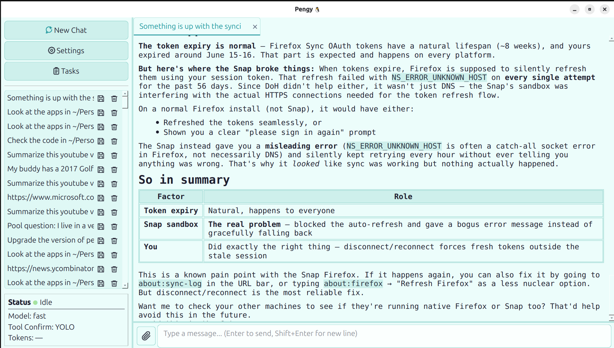

# Pengy 🐧

**A local-first AI agent with tools.** Desktop GUI, web UI, **and** command-line — all backed by the same agent core, talking to any OpenAI-compatible API.

[](https://pypi.org/project/pengy/)
[](https://pypi.org/project/pengy/)
[](https://github.com/patw/pengy/blob/main/LICENSE)

---

## What is Pengy?

Pengy is an LLM agent that runs on your own machine. It connects to OpenAI, Ollama, vLLM, Groq, OpenRouter, or any local endpoint, and gives the model a set of tools to operate on your filesystem, run code, search the web, and fetch URLs — all with your approval.

Three interfaces, one agent:

| **🐧 Pengy Desktop** | **🐧 Pengy CLI** | **🐧 Pengy Web** |
|---|---|---|
| Qt6 GUI with markdown rendering, multi-session sidebar, file attachments | Terminal REPL with slash commands, single-shot mode for scripting | Flask web UI with Bootstrap, responsive layout, SSE live streaming |

All three share the same core — same tools, same chat history, same config. Use whichever fits your flow.

---

## Quick Start

### Install

Pengy requires **Python 3.10+**. On macOS, the default `/usr/bin/python3` may be too old, so the recommended install method is [`uv`](https://docs.astral.sh/uv/), which can install Pengy with a compatible Python automatically:

```bash
# Install uv if needed
curl -LsSf https://astral.sh/uv/install.sh | sh

# Everything (GUI + CLI + Web)
uv tool install "pengy[all]"

# CLI only
uv tool install "pengy[cli]"

# GUI only
uv tool install "pengy[gui]"

# Web UI only
uv tool install "pengy[web]"
```

If you already have Python 3.10+ available, `pip` also works:

```bash
# Everything (GUI + CLI + Web)
pip install "pengy[all]"

# CLI only
pip install "pengy[cli]"

# GUI only
pip install "pengy[gui]"

# Web UI only
pip install "pengy[web]"

# Minimum (no GUI, no CLI — use as a library)
pip install pengy
```

### Desktop GUI

```bash
pengy
```

### CLI (interactive)

```bash
pengy-cli
```

### CLI (single-shot)

```bash
pengy-cli "What is the capital of France?"
pengy-cli "List all files in /tmp"
```

### Web UI

```bash
# Localhost only (default)
pengy-web

# Listen on all interfaces (for nginx reverse proxy)
pengy-web --host 0.0.0.0

# Custom port
pengy-web --host 0.0.0.0 --port 8080

# Behind a reverse proxy, when Pengy stays on loopback
pengy-web --trusted-host pengy.example
```

The web UI is designed for single-user personal use. For remote access, put it behind nginx with SSL and HTTP basic auth — Pengy itself has no authentication.

#### Reverse proxies and `--trusted-host`

Pengy Web rejects requests whose `Origin` doesn't match the host they were sent to, which blocks CSRF, and — when bound to loopback — rejects unexpected `Host` headers, which blocks DNS rebinding. Both attacks come from your own browser, so a loopback bind alone does not stop them.

That last check needs help in one specific case: **a reverse proxy in front of a loopback bind.** nginx presents Pengy with either the public domain or its own upstream address, and neither matches what the check expects. Name the public hostname and both forms are accepted:

```bash
pengy-web --trusted-host pengy.example              # repeatable
```

You need it if **all** of these are true:

- Pengy is bound to loopback (the default — no `--host`)
- something proxies to it (nginx, Caddy, Traefik, `ssh -L`)
- you reach it under a hostname other than `localhost`

You do **not** need it when Pengy binds the network itself (`--host 0.0.0.0`, or a LAN IP) — including a Docker container with a published port, or a media server browsed from phones and laptops on your LAN. Those already work unmodified.

Symptom of a missing flag: every request 403s, or GETs work while every POST 403s. Both mean `--trusted-host`.

---

## Features

- **OpenAI-compatible** — Works with OpenAI, Ollama, vLLM, LM Studio, OpenRouter, Groq, or any local endpoint
- **14 built-in tools** — Read, write, and edit files; run bash (with sudo support) and Python code; search the web and fetch URLs; explore directory trees and search codebases; find files by glob patterns; track multi-step tasks with structured todo lists; ask clarifying questions when ambiguous
- **Agentic workflow** — The LLM can call multiple tools per turn, chaining them to accomplish complex tasks
- **Tool confirmation** — Three modes: YOLO (All) skips all confirmations, Safe auto-approves read-only tools, None confirms everything
- **Context management** — Elide old tool results to save context window space; configurable per-chat
- **Token usage display** — See prompt/completion token counts after every turn (GUI sidebar + CLI footer)
- **Theme system** — System, light, and dark modes plus selectable accent colors; applied across the desktop UI with scaled markdown/code rendering
- **Tasks system** — Reusable prompt templates for repeated workflows, with `%placeholder%` inputs collected at run time
- **Model discovery** — Fetch available models from your endpoint with one click or `/models` command
- **Multi-session** — Create, switch, and delete chat sessions; history saved locally as JSON; shared across all interfaces
- **File attachments** — GUI: attach files from the input bar; CLI: use `/attach <path>` or `@path` inline syntax
- **Web UI** — Responsive Bootstrap interface served by Flask; SSE live streaming; works great on mobile
- **Slash commands** (CLI) — `/new`, `/load`, `/models`, `/yolo`, `/model`, `/list`, `/delete`, `/attach`, `/compact`, and more
- **Templated system message** — Auto-fills `{date}`, `{username}`, `{hostname}`, `{osinfo}` at send time
- **Persistent config** — Settings, task templates, and chat history live in `~/.config/pengy/`, shared between GUI, CLI, and Web — and across all Pengy versions (Python, Rust, C++)

---

## Screenshots

| Main chat UI | Settings / theme controls | Tasks templates |
|---|---|---|
|  |  |  |

---

## Configuration

**Desktop:** Click ⚙ Settings in the sidebar.  
**CLI:** Run `/config` to view, `/model <name>` to switch models.  
**Web:** Click ⚙ in the top-right navbar.

| Setting | Description |
|---------|-------------|
| Base URL | API endpoint (e.g. `http://localhost:11434/v1` for Ollama) |
| API Key | Your API key (or anything for local endpoints) |
| Model | Model name, e.g. `gpt-4o`, `llama3`, `gemma` |
| System Message | Supports `{date}`, `{username}`, `{hostname}`, `{osinfo}` placeholders |
| Tool Confirmation | YOLO (All) / Safe Only / None — controls which tools require approval |
| Theme Mode (GUI) | System / Light / Dark — System follows the OS palette |
| Accent Color (GUI) | Default, Blue, Teal, Green, Orange, Red, Pink, or Purple |
| UI Scale (GUI) | 75 / 100 / 125 / 150 / 175 / 200 % — restart for full native-widget scaling |

---

## Theme System

The desktop UI includes a theme system built around two choices:

- **Mode:** `System`, `Light`, or `Dark`. `System` follows the current OS/Qt palette.
- **Accent:** `Default`, `Blue`, `Teal`, `Green`, `Orange`, `Red`, `Pink`, or `Purple`. The accent drives buttons, links, focus rings, selection colours, and other highlights.

Theme settings are saved in `~/.config/pengy/settings.json` as `theme_mode`, `theme_accent`, and `ui_scale`, so they travel with the rest of your local Pengy configuration. The renderer also scales explicit markdown, code, and input fonts so the chat view tracks the configured UI scale instead of only resizing native widgets.

---

## Tasks

Tasks are reusable prompt templates for workflows you repeat often — for example summarizing a YouTube video, drafting a release note, or running a standard code-review checklist. Open **Tasks** from the desktop sidebar to create, edit, delete, or play templates.

A task has a title and a prompt template. Use `%placeholder%` tokens anywhere in the template to ask for values when the task is played:

```text
Summarize this YouTube video: %Youtube Video URL%
Always use the youtube transcription skill.
```

When you click **▶ Play**, Pengy asks for each unique placeholder once, renders the final prompt, and sends it through the normal chat path so tools, skills, history, and confirmation settings all work exactly like a hand-written prompt. Tasks are stored locally in `~/.config/pengy/tasks.json` and are shared by the Python, Rust, and C++ editions.

---

## Tools

Pengy gives the LLM these tools to operate on your machine:

| Tool | Description |
|------|-------------|
| `read_file` / `read_multiple_files` | Read one or more files at once |
| `write_file` | Write or overwrite a file |
| `replace_in_file` | Targeted text replacement (safer than full rewrites) |
| `run_bash` | Execute shell commands (configurable timeout; sudo password dialog) |
| `run_python` | Execute Python code (uses the same interpreter/venv as Pengy) |
| `web_search` | DuckDuckGo web search |
| `download_file` | Download a URL to `~/Downloads/` |
| `fetch_url` | Fetch a URL's text content into context |
| `directory_tree` | Visual directory structure listing |
| `search_content` | Regex search across files in a codebase |
| `glob` | Find files by glob pattern (`**/*.py`); respects `.gitignore`-style skips |
| `todowrite` | Structured task list for tracking complex multi-step operations |
| `ask_user_question` | Ask clarifying multiple-choice questions when instructions are vague |

`glob`, `todowrite`, and `ask_user_question` were added to address the **cognitive** gaps beyond mechanical file/code/web operations: `glob` replaces slow, noisy `find`/`ls` commands with fast structured results; `todowrite` gives the LLM a persistent scratchpad that survives context truncation; `ask_user_question` lets the agent pause and clarify instead of guessing when instructions are vague.

---

## Skills

The 14 built-in tools cover the basics, but Pengy is designed to be extended with **skills** — your own custom instructions and scripts stored as plain markdown files.

Skills are not a plugin system. There is no SDK, no manifest file, no packaging. A skill is just a `skillname/skillname_skill.md` file with instructions Pengy can read, optionally backed by a bash or Python script. You point Pengy at a directory of these, and it uses them automatically.

This means your Pengy can do whatever you need it to:
- Fetch weather from an API
- Control devices on your home network
- Query your local databases
- Generate reports from your own data
- Run system administration tasks
- Send notifications, emails, or messages
- Anything you can describe in a prompt and a script

Skills are also self-authoring — you can ask Pengy to create new skills for you, write the markdown, write the script, and update the skill index, all in one conversation.

**📖 Read the full guide:** [`skills/README.md`](skills/README.md) — covers the philosophy, how skills work, 4 complete examples with code, how to make your own, and a call to action to build your first skill.

---

## API Compatibility

| Service | Base URL |
|---------|----------|
| OpenAI | `https://api.openai.com/v1` |
| Ollama | `http://localhost:11434/v1` |
| LM Studio | `http://localhost:1234/v1` |
| vLLM | `http://localhost:8000/v1` |
| OpenRouter | `https://openrouter.ai/api/v1` |
| Groq | `https://api.groq.com/openai/v1` |

---

## Project Structure

```
pengy/
├── main.py              # Desktop GUI entry point
├── cli/
│   └── main.py          # CLI entry point (interactive + single-shot)
├── assets/
│   └── icon.png         # App icon
├── core/
│   ├── config.py        # Settings load/save + system message templating
│   ├── chat_manager.py  # Chat session CRUD
│   ├── task_manager.py  # Task template CRUD + placeholder rendering
│   ├── llm_client.py    # API client (generator protocol for tool handling)
│   └── tools.py         # Tool definitions and execution
├── ui/
│   ├── main_window.py   # Main window; wires all signals
│   ├── chat_history.py  # Sidebar chat list + quick settings
│   ├── chat_view.py     # Markdown chat renderer
│   ├── chat_input.py    # Input field + file attachment
│   ├── chat_worker.py   # Background thread driving the LLM generator
│   ├── settings_dialog.py  # Settings dialog
│   ├── tasks_dialog.py     # Task template manager/player
│   └── theme.py            # Light/dark/accent theme system
└── web/
    ├── app.py           # Flask application (routes, WebWorker, SSE)
    ├── main.py          # Web entry point (argparse, app.run)
    └── templates/
        ├── base.html    # Navbar, sidebar, Bootstrap layout
        ├── chat.html    # Chat view + JS SSE client
        └── settings.html # Settings form
```

---

## Development

### Install from source

```bash
git clone https://github.com/patw/pengy.git
cd pengy
uv sync --extra all
```

Or, with Python 3.10+ already available:

```bash
pip install -e ".[all]"
```

### Running tests

```bash
pip install -e ".[all]"
python -m pytest tests/ -v
```

---

## Dependencies

| Package | Purpose |
|---------|---------|
| PySide6 | Qt6 GUI framework |
| flask | Web UI framework |
| openai | OpenAI-compatible API client |
| markdown | Markdown rendering (GUI + Web) |
| pygments | Syntax highlighting (GUI + Web) |
| ddgs | DuckDuckGo web search |
| rich | CLI formatting (tables, panels, markdown) |

---

## Also Available

Pengy (Python) is the **reference implementation**. Two high-performance ports are also fully certified, all sharing the same `~/.config/pengy/` data:

| Edition | Language | Notes |
|---------|----------|-------|
| [**Pengy**](https://github.com/patw/Pengy) | Python | Reference implementation — easiest to hack on |
| [**PengyR**](https://github.com/patw/PengyR) | Rust + Qt6 | High-performance native binary, statically-linked core |
| [**PengyCPP**](https://github.com/patw/PengyCPP) | C++17 + Qt6 | Highest performance, smallest memory footprint, zero external dependencies |

All three offer the same 14 tools, desktop theme controls, reusable task templates, three interfaces (GUI/CLI/Web), and full chat/task interop. PengyR and PengyCPP ship pre-built AppImage, `.deb`, `.dmg`, and `.zip` releases for Linux, macOS, and Windows.

---

## License

MIT
