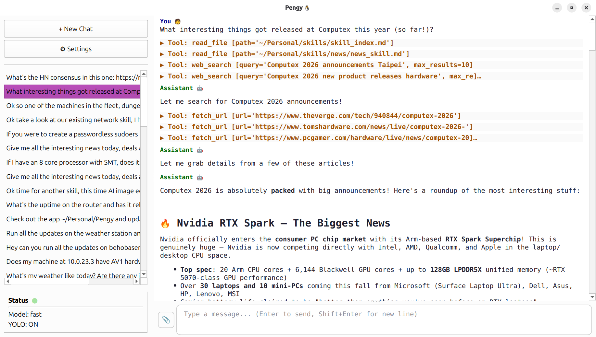

# Pengy 🐧

**A local-first AI agent with tools.** Desktop GUI **and** command-line — both backed by the same agent core, talking to any OpenAI-compatible API.

[](https://pypi.org/project/pengy/)
[](https://pypi.org/project/pengy/)
[](https://github.com/patw/pengy/blob/main/LICENSE)

---

## What is Pengy?

Pengy is an LLM agent that runs on your own machine. It connects to OpenAI, Ollama, vLLM, Groq, OpenRouter, or any local endpoint, and gives the model a set of tools to operate on your filesystem, run code, search the web, and fetch URLs — all with your approval.

Two interfaces, one agent:

| **🐧 Pengy Desktop** | **🐧 Pengy CLI** |
|---|---|
| Qt6 GUI with markdown rendering, multi-session sidebar, file attachments | Terminal REPL with slash commands, single-shot mode for scripting |

Both share the same core — same tools, same chat history, same config. Use whichever fits your flow.

---

## Quick Start

### Install

```bash
# Everything (GUI + CLI)
pip install pengy[all]

# CLI only
pip install pengy[cli]

# GUI only
pip install pengy[gui]

# Minimum (no GUI, no CLI — use as a library)
pip install pengy
```

### Desktop GUI

```bash
pengy
```

### CLI (interactive)

```bash
pengy-cli
```

### CLI (single-shot)

```bash
pengy-cli "What is the capital of France?"
pengy-cli "List all files in /tmp"
```

---

## Features

- **OpenAI-compatible** — Works with OpenAI, Ollama, vLLM, LM Studio, OpenRouter, Groq, or any local endpoint
- **11 built-in tools** — Read, write, and edit files; run bash (with sudo support) and Python code; search the web and fetch URLs; explore directory trees and search codebases
- **Agentic workflow** — The LLM can call multiple tools per turn, chaining them to accomplish complex tasks
- **Tool confirmation** — Three modes: YOLO (All) skips all confirmations, Safe auto-approves read-only tools, None confirms everything
- **Context management** — Elide old tool results to save context window space; configurable per-chat
- **Token usage display** — See prompt/completion token counts after every turn (GUI sidebar + CLI footer)
- **Model discovery** — Fetch available models from your endpoint with one click or `/models` command
- **Multi-session** — Create, switch, and delete chat sessions; history saved locally as JSON
- **File attachments** — GUI: attach files from the input bar; CLI: use `/attach <path>` or `@path` inline syntax
- **Slash commands** (CLI) — `/new`, `/load`, `/models`, `/yolo`, `/model`, `/list`, `/delete`, `/attach`, `/compact`, and more
- **Templated system message** — Auto-fills `{date}`, `{username}`, `{hostname}`, `{osinfo}` at send time
- **Persistent config** — Settings and chat history live in `~/.config/pengy/`, shared between GUI and CLI

---

## Screenshot



---

## Configuration

**Desktop:** Click ⚙ Settings in the sidebar.  
**CLI:** Run `/config` to view, `/model <name>` to switch models.

| Setting | Description |
|---------|-------------|
| Base URL | API endpoint (e.g. `http://localhost:11434/v1` for Ollama) |
| API Key | Your API key (or anything for local endpoints) |
| Model | Model name, e.g. `gpt-4o`, `llama3`, `gemma` |
| System Message | Supports `{date}`, `{username}`, `{hostname}`, `{osinfo}` placeholders |
| Tool Confirmation | YOLO (All) / Safe Only / None — controls which tools require approval |
| UI Scale (GUI) | 75 / 100 / 125 / 200 % — takes effect on next launch |

---

## Tools

Pengy gives the LLM these tools to operate on your machine:

| Tool | Description |
|------|-------------|
| `read_file` / `read_multiple_files` | Read one or more files at once |
| `write_file` | Write or overwrite a file |
| `replace_in_file` | Targeted text replacement (safer than full rewrites) |
| `run_bash` | Execute shell commands (configurable timeout; sudo password dialog) |
| `run_python` | Execute Python code (uses the same interpreter/venv as Pengy) |
| `web_search` | DuckDuckGo web search |
| `download_file` | Download a URL to `~/Downloads/` |
| `fetch_url` | Fetch a URL's text content into context |
| `directory_tree` | Visual directory structure listing |
| `search_content` | Regex search across files in a codebase |

---

## API Compatibility

| Service | Base URL |
|---------|----------|
| OpenAI | `https://api.openai.com/v1` |
| Ollama | `http://localhost:11434/v1` |
| LM Studio | `http://localhost:1234/v1` |
| vLLM | `http://localhost:8000/v1` |
| OpenRouter | `https://openrouter.ai/api/v1` |
| Groq | `https://api.groq.com/openai/v1` |

---

## Project Structure

```
pengy/
├── main.py              # Desktop GUI entry point
├── cli/
│   └── main.py          # CLI entry point (interactive + single-shot)
├── assets/
│   └── icon.svg         # App icon
├── core/
│   ├── config.py        # Settings load/save + system message templating
│   ├── chat_manager.py  # Chat session CRUD
│   ├── llm_client.py    # API client (generator protocol for tool handling)
│   └── tools.py         # Tool definitions and execution
└── ui/
    ├── main_window.py   # Main window; wires all signals
    ├── chat_history.py  # Sidebar chat list + quick settings
    ├── chat_view.py     # Markdown chat renderer
    ├── chat_input.py    # Input field + file attachment
    ├── chat_worker.py   # Background thread driving the LLM generator
    └── settings_dialog.py  # Settings dialog
```

---

## Development

### Install from source

```bash
git clone https://github.com/patw/pengy.git
cd pengy
pip install -e ".[all]"
```

### Running tests

```bash
pip install -e ".[all]"
python -m pytest tests/ -v
```

---

## Dependencies

| Package | Purpose |
|---------|---------|
| PySide6 | Qt6 GUI framework |
| openai | OpenAI-compatible API client |
| markdown | Markdown rendering |
| pygments | Syntax highlighting |
| ddgs | DuckDuckGo web search |
| rich | CLI formatting (tables, panels, markdown) |
