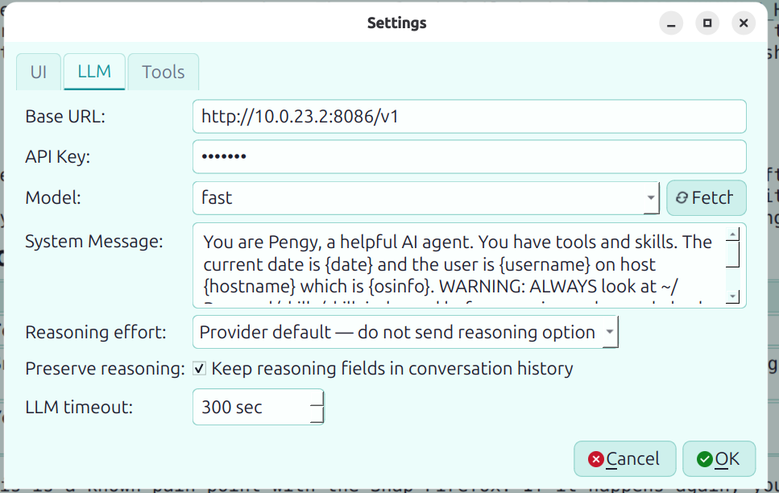

# Pengy 🐧

**A local-first AI agent with tools.** Desktop GUI, web UI, **and** command-line — all backed by the same agent core, talking to any OpenAI-compatible API.

[](https://pypi.org/project/pengy/)
[](https://pypi.org/project/pengy/)
[](https://github.com/patw/pengy/blob/main/LICENSE)

---

## What is Pengy?

Pengy is an LLM agent that runs on your own machine. It defaults to a **local server** — Ollama's OpenAI-compatible port — and also speaks to llama.cpp, vLLM, LM Studio, or any hosted OpenAI-compatible API (OpenAI, Groq, OpenRouter). It gives the model 16 built-in tools to operate on your filesystem, inspect images, run code, search the web, and more — all with your approval.

Three interfaces, one agent:

| **🐧 Pengy Desktop** | **🐧 Pengy CLI** | **🐧 Pengy Web** |
|---|---|---|
| Qt6 GUI with tabbed chat, markdown rendering, sidebar with history & quick settings, file attachments | Terminal REPL with slash commands, single-shot mode for scripting | Responsive web UI with SSE streaming. Run on a server, use from your phone |

All three share the same core, tools, chat history, and config. Use whichever fits your flow.

---

## Quick Start

### Install

```bash
# Recommended — uv installs Pengy with a compatible Python automatically
curl -LsSf https://astral.sh/uv/install.sh | sh
uv tool install pengy

# Or with pip (Python 3.10+)
pip install pengy
```

That one command gives you the **complete headless experience** — agent core,
terminal CLI and browser Web UI, no extra flags and no Qt download:

| Command | What it does |
|---|---|
| `pengy-cli` | interactive REPL, or single-shot: `pengy-cli "What is the capital of France?"` |
| `pengy-web` | browser UI on http://127.0.0.1:5000 |

### Desktop GUI (optional)

The Qt desktop app is the only piece that is not installed by default — it is a
~80 MB download and needs a display:

```bash
pip install "pengy[gui]"                     # or: uv tool install --force "pengy[gui]"
pengy
```

Prefer a **native** desktop app with no Python at all? The Rust and C++ editions
ship AppImage, `.deb`, `.dmg` and Windows `.zip` builds:

**https://github.com/patw/PengyR/releases**

> `pengy[all]` and `pengy[desktop]` are aliases that add the GUI. `pengy[cli]` and
> `pengy[web]` still work, but their dependencies are now part of the default
> install — asking for them adds nothing.

#### Add Pengy to your application menu (Linux)

A pip/uv-tool install gives you commands, not a menu icon. Ask the program to add
one — user-level only, no sudo, nothing installed system-wide:

```bash
pengy --install-launcher      # add a menu entry + icon
pengy --uninstall-launcher    # remove it again
```

It writes `~/.local/share/applications/pengy.desktop` plus a 256×256 icon under
`~/.local/share/icons/hicolor/`, and refreshes the desktop/icon caches. The entry
launches *this* environment's interpreter, so it never picks up a different Pengy
edition that happens to be earlier on your `PATH`.

If a `pengy.desktop` already exists that Pengy did not write — for example a
launcher for the native AppImage build — the command **refuses to replace it** and
shows you the existing `Exec=` line. Add `--force` if you really mean to overwrite
it.

(On Linux, `sudo dpkg -i pengy_*.deb` already does all of this system-wide — the
launcher command is for pip-style installs.)

#### Windows: use `pengy-gui` for shortcuts

`pengy` is a console program, so a shortcut to it shows a black console window
behind the GUI. Point shortcuts at **`pengy-gui`** instead — it is packaged as a
console-less launcher. `pengy` keeps its console so `pengy --version` still prints
in a terminal.

### CLI (interactive or single-shot)

First, make sure there is a model to talk to. The default endpoint is a local
server, so all it takes is Ollama itself — and no API key, ever:

```bash
ollama serve                  # if it is not already running
ollama pull llama3.2          # any model you like
pengy-cli /models             # list what the endpoint offers
pengy-cli /model llama3.2     # select one
```

There is deliberately **no default model**: a local server ships none of its own,
so naming one would simply fail on your first message. Until you pick one, Pengy
says so and tells you how — it never sends an empty model name to the endpoint.

Using a different server (llama.cpp, vLLM, LM Studio) or a hosted API? Point
Pengy at it once, and it is remembered:

```bash
pengy-cli /baseurl http://127.0.0.1:8080/v1     # llama.cpp
pengy-cli /baseurl https://api.openai.com/v1    # or a hosted API…
pengy-cli /apikey sk-...                        # …which needs a key
```

The same settings live in Settings in the GUI and Web UI.

```bash
pengy-cli
pengy-cli "What is the capital of France?"
```

### Web UI

```bash
pengy-web
```

The web UI is for single-user personal use. For remote access, put it behind nginx with SSL; use `--trusted-host` to set the public hostname when reverse-proxying.

---

## Features

- **Local-first** — Defaults to a local Ollama endpoint (no API key, no account). Also works with llama.cpp, vLLM, LM Studio, OpenRouter, Groq, OpenAI, or any OpenAI-compatible endpoint
- **16 built-in tools** — Read files and inspect images; write and edit files transactionally; run bash (with sudo support) and Python; search the web and fetch URLs; explore directories, glob files, and search code; track multi-step ops with structured to-do lists; ask clarifying questions when instructions are vague
- **Agentic workflow** — The LLM chains multiple tool calls per turn, piping results from one into the next
- **Tool confirmation** — Three modes: auto-approve everything, auto-approve read-only tools only, or confirm every call
- **Tabbed chat** — Multiple concurrent chat sessions, each with its own worker thread
- **Theme system** — System/light/dark modes plus 8 accent colours; fonts scale with the UI
- **Tasks** — Reusable prompt templates with `%placeholder%` tokens for workflows you run on repeat
- **Model discovery** — Fetch available models from your endpoint with one click or `/models`
- **File attachments** — GUI: attach from the input bar; CLI: `/attach` or `@path` syntax
- **Templated system message** — Auto-fills `{date}`, `{username}`, `{hostname}`, `{osinfo}` at send time
- **Persistent config** — Settings, task templates, and chat history in `~/.config/pengy/`, shared between all interfaces and across all editions (Python, Rust, C++)

---

## Screenshots

| Main chat UI | Settings / theme controls | Tasks templates |
|---|---|---|
|  |  |  |

---

## Configuration

**Desktop:** Click ⚙ Settings in the sidebar.  
**CLI:** Run `/config` to view, `/model <name>` to switch models.  
**Web:** Click ⚙ in the top-right navbar.

> **First run? Configure before you chat.** Pengy keeps its credentials in its own
> settings file (`~/.config/pengy/settings.json`, shared by the CLI, Web UI and GUI).
> Environment variables like `OPENAI_API_KEY` are **not** read. From the CLI:
> `/apikey <key>`, `/baseurl <url>`, `/model <name>`; or open `pengy-web` → Settings.
>
> If credentials are missing or wrong, Pengy tells you exactly that (and prints the
> commands above) instead of relaying the API's own env-var advice — and exits **2**
> so scripts can tell configuration failures apart from other errors (**1**;
> interactive mode always exits 0).

| Setting | Description |
|---------|-------------|
| Base URL | API endpoint — defaults to `http://127.0.0.1:11434/v1` (Ollama) |
| API Key | Your API key (or anything for local endpoints) |
| Model | Model name, e.g. `llama3.2`, `qwen3:8b`, `gemma3` — **no default**, see below |
| System Message | Supports `{date}`, `{username}`, `{hostname}`, `{osinfo}` placeholders |
| Tool Confirmation | All / Safe / None — controls which tools require approval |
| Theme Mode (GUI) | System / Light / Dark — follows OS palette |
| Accent Color (GUI) | Default, Blue, Teal, Green, Orange, Red, Pink, or Purple |
| UI Scale (GUI) | 75–200% — restart for full native-widget scaling |

---

## Tasks

Tasks are reusable prompt templates for workflows you repeat often — summarizing a YouTube video, drafting a release note, or running a code-review checklist. Open **Tasks** from the desktop sidebar to create, edit, delete, or play templates.

Use `%placeholder%` tokens anywhere in the template to ask for values when the task is played:

```text
Summarize this YouTube video: %Youtube Video URL%
Always use the youtube transcription skill.
```

When you hit **▶ Play**, Pengy collects each placeholder once, renders the full prompt, and sends it through the normal chat pipeline — tools, skills, history, and confirmation settings all work exactly like a hand-typed prompt. Tasks live in `~/.config/pengy/tasks.json`, shared across all interfaces and editions.

---

## Tools

Pengy gives the LLM these 16 tools to operate on your machine (17 on Windows, which adds `run_powershell`):

| Tool | Description |
|------|-------------|
| `read_file` / `read_multiple_files` | Read one or more files at once |
| `read_image` | Inspect a local image, screenshot, photo, diagram, or chart |
| `write_file` | Write or overwrite a file |
| `replace_in_file` | Targeted text replacement (safer than full rewrites) |
| `apply_changes` | Multi-file transactional edits with diff preview |
| `run_bash` | Execute shell commands locally or on a remote host over ssh (configurable timeout; sudo support, including remote sudo). On Windows, remote hosts only |
| `run_powershell` | Windows only: run PowerShell scripts locally (PowerShell 7 if installed, else Windows PowerShell 5.1), with the privileges Pengy was started with |
| `run_python` | Execute Python code |
| `web_search` | DuckDuckGo web search |
| `download_file` | Download a URL to `~/Downloads/` |
| `fetch_url` | Fetch a URL's text content into context |
| `directory_tree` | Visual directory structure listing |
| `search_content` | Regex search across files in a codebase |
| `glob` | File pattern matching — respects `.gitignore`-style skips |
| `todowrite` | Structured task list for tracking multi-step operations |
| `ask_user_question` | Multi-choice questions to clarify vague requests |

---

## Skills

The 16 built-in tools cover the basics, but Pengy is designed to be extended with **skills** — local instruction files with optional helper scripts.

A local skill normally has a `skillname/skillname_skill.md` instruction file, optionally backed by a bash or Python helper. Put installed skills under `~/skills/` and list them in `skill_index.md`; Pengy's system instructions tell it to consult that index and read the selected skill before acting. For reusable packages, [BotSkills](https://skills.catbee.ca) lets you inspect a skill, download its ZIP, and review its manifest and helper scripts before installing it.

This means your Pengy can do whatever you need it to:
- Fetch weather from an API
- Control devices on your home network
- Query your local databases
- Generate reports from your own data
- Run system administration tasks
- Send notifications, emails, or messages
- Map repository structure and run test suites
- Anything you can describe in a prompt and a script

Skills are also self-authoring — ask Pengy to create one for you, and it writes the markdown, writes the script, and updates the index, all in one conversation.

**📖 Start with [BotSkills](https://skills.catbee.ca) or read the full local guide:** [`skills/README.md`](skills/README.md) — covers the philosophy, how skills work, 4 complete examples, and how to make your own.

---

## API Compatibility

| Service | Base URL |
|---------|----------|
| OpenAI | `https://api.openai.com/v1` |
| Ollama | `http://localhost:11434/v1` |
| LM Studio | `http://localhost:1234/v1` |
| vLLM | `http://localhost:8000/v1` |
| OpenRouter | `https://openrouter.ai/api/v1` |
| Groq | `https://api.groq.com/openai/v1` |

---

## Development

### Project structure

```
pengy/
├── main.py              # Desktop GUI entry point
├── cli/                 # CLI entry point
├── core/                # Config, chat manager, tools, LLM client
├── ui/                  # Chat view, input, workers, settings, theme
└── web/                 # Flask app, routes, SSE, templates
```

### Install from source

```bash
git clone https://github.com/patw/pengy.git
cd pengy
# CLI + Web UI (default install — no Qt needed)
uv sync

# Add the Qt desktop GUI
uv sync --extra gui

Or with pip:

```bash
pip install -e .            # CLI + Web UI
pip install -e ".[gui]"     # + Qt desktop GUI
```

### Running tests

```bash
python -m pytest tests/ -v
```

### Dependencies

| Package | Purpose | Installed by default? |
|---------|---------|:---------------------:|
| openai | OpenAI-compatible API client | ✅ |
| ddgs | DuckDuckGo web search | ✅ |
| Pillow | Image attachments and processing | ✅ |
| flask | Web UI framework | ✅ |
| rich | CLI formatting (tables, panels, markdown) | ✅ |
| markdown | Markdown rendering (Web) | ✅ |
| pygments | Syntax highlighting (Web) | ✅ |
| PySide6-Essentials | Qt6 desktop GUI (`pengy[gui]`) | ❌ optional |

> The GUI depends on `PySide6-Essentials`, not the `PySide6` meta-package: the GUI
> imports only QtCore/QtGui/QtWidgets/QtSvg, so `PySide6-Addons` (~175 MB Linux,
> ~332 MB macOS) is never downloaded.

---

## Also Available

Pengy (Python) is the **reference implementation**. Two high-performance ports share the same `~/.config/pengy/` data directory:

| Edition | Language | Notes |
|---------|----------|-------|
| [**Pengy**](https://github.com/patw/Pengy) | Python | Reference implementation — easiest to hack on |
| [**PengyR**](https://github.com/patw/PengyR) | Rust + Qt6 | High-performance native binary, statically-linked core |
| [**PengyCPP**](https://github.com/patw/PengyCPP) | C++17 + Qt6 | Highest performance, smallest memory footprint |

All three offer the same 16 tools, durable image attachments, desktop theme controls, reusable task templates, three interfaces (GUI/CLI/Web), and full chat/task interop. PengyR and PengyCPP ship pre-built AppImage, `.deb`, `.dmg`, and `.zip` releases; Pengy (this one) installs from PyPI with `pip install pengy`, which includes the CLI and Web UI, plus the Qt GUI via `pengy[gui]`.

---

## Documentation

- [Configuration reference](docs/configuration.md) — all settings.json fields explained
- [Reverse proxy setup](docs/reverse-proxy.md) — nginx, Caddy, SSH tunnels, Docker
- [Skills deep-dive](docs/skills.md) — skill patterns, `~/.secrets`, `uv` dependencies
- [API compatibility](docs/api-compatibility.md) — provider support, model discovery, local endpoints
- [FAQ](docs/faq.md) — common questions and troubleshooting
- [Building from source](docs/building.md) — platform-specific build instructions
- [Changelog](CHANGELOG.md) — version history

## License

MIT
